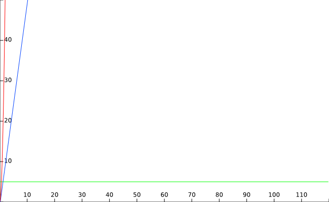
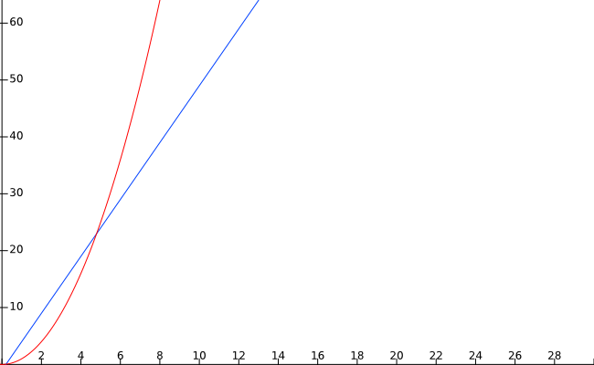
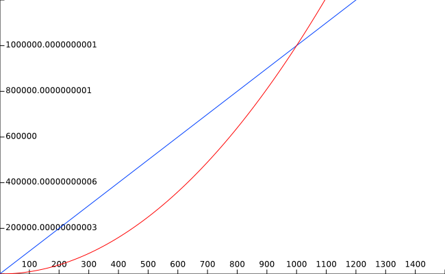

# Анализ алгоритмов / Rate of growth
## Подсчет сложности алгоритмов
Если у нас есть несколько алгоритмов для решения одинаковой задачи то нам бы хотелось выбрать, какой из них мы будем использовать для задачи. Для этого требуется их как то сравнить. Самый очевидный вариант — просто замерить время выполнения одного и другого алгоритма. В целом, это вполне рабочий вариант, но что делать если алгоритмов много, а замерять каждый — долго? Можно попробовать аналитически оценить сложность выполнения алгоритмов.

Для этого будем считать что каждая конкретная инструкция занимает некое константное время (какое именно — не важно, будем считать что все единичные операции занимают одинаковое константное время). И посчитаем все операции, которые выполняет этот алгоритм. Посмотрим на несколько примеров

### Подсчет сложности алгоритма с константной сложностью
Рассмотрим простейший алгоритм сложения двух чисел и вывода результата в консоль.
```
1.    public static void PrintSum(int x, int y)
2.    {
3.        int sum = x + y;                    
4.        Console.WriteLine("Sum: " + sum);
5.    }
```
Нас интересуют 3 и 4 строчки. В 3 строчке 2 операции: сложение и присваивание. В 4 строчке 3 операции: преобразование целочисленной переменной в строковую, конкатенация строк и вывод полученной строки на экран. 

Получается, сложность этого алгоритма: 2 + 3 = 5.

### Подсчет сложности алгоритма с линейной сложностью
Рассмотрим алгоритм линейного поиска. Для простоты предположим что массив не может быть пустым. 
```
1.    public static int Max(int[] array)
2.    {
3.        int max = array[0];
4.        for (int i = 1; i < array.Length; i++)
5.        {
6.            if (array[i] > max)
7.                max = array[i];
8.        }
9.        return max;
10.    }
```
На 3 строке выполняется 2 операции - взятие значение из массива и присваивание его в переменную.\
На 9 строке выполняется 1 операция return.\
На строчках 4 - 7 выполняется переменное количество операций. Количество этих операций зависит от размера массива, полученного на входе. Приравняем это число к n.\
Тогда на строчке 4 выполняется 1 + n - 1 + n - 1 операций: 1 операция присваивания, n - 1 операций сравнения и n - 1 операций инкремента.\
На 6 строчке выполняется n - 1 операций сравнения.\
На 7 строчке выполняется n - 1 операций присваивания и n - 1 взятия значения из массива, если массив отсортирован по возрастанию и 0 операций если массив отсортирован по убыванию.\
Без учета 7 строки сложность алгоритма получается 2 + 1 + 1  n - 1 + n - 1 + n - 1 = 3n + 1. C учетом 7 строки сложность будет в лучшем случае 3n + 1, а в худшем 3n + 1 + 2 * (n - 1) = 5n - 1\
Назовем функцию поиска максимального элемента в массиве T. Она зависит от размера входных данных (массива) n. Тогда можно сказать что функция поиска максимального значения T(n) имеет сложность 5n - 1 в худшем случае, то есть T(n) = 5n - 1.

### Подсчет сложности алгоритма с квадратичной сложностью
Рассмотрим алгоритм сортировки выбором
```
1.    public static void Sort(int[] array)
2.    {
3.        for (int i = 0; i < array.Length - 1; i++)
4.        {
5.            var minValueIndex = i;
6.            
7.            for (int j = i + 1; j < array.Length; j++)
8.            {
9.                if (array[minValueIndex] > array[j])
10.                   minValueIndex = j;
11.           }
12.   
13.           var temp = array[minValueIndex];
14.           array[minValueIndex] = array[i];
15.           array[i] = temp;
16.       }
17.   }
```
На 3 строчке выполняется 2 * n + 1 операций.\
Все операции внутри цикла for выполняются n раз.\
Таким образом на 5 строчке выполняется n * 1 операций.\
На 6 строчке выполняется n * 2 операций.\
На 7 строчке новый цикл. Сам по себе он выполняется 2 * (n - i + 1) + 2 раза: присваивание и суммирование - 2 операции, сравнение - (n - i + 1) операций, инкремент - еще (n - i + 1). Это накладывается на внешний цикл который добавляет еще множитель n. То есть в итоге: n * (2 * (n - i + 1) + 2).\
На 9 строчке выполняется 3 операции, которые домножаются на операции внешених циклов.\
На 10 строчке выполняется 1 операция, которая домножается на операции внешених циклов. Будем рассматривать худший случай упорядоченности входных данных для упрощения.\
На 13 строчке - 2 операции.\
На 14 строчке - 3 операции.\
На 15 строчке - 2 операции.\
Операции на строчках 13-15 доманжаются на количество операций внешнего цикла. 
Итого получается: 2 * n - 1 + n * 1 + n * 2 + n * (2 * (n - i + 1) + 2) + n * (n - i + 1) * 3 + n * (n - i + 1) * 1 + n * (n - i + 1) * (2 + 3 + 2)\
В нашем случае появляется еще одна переменная - i. Поскольку мы будем сравнивать наш алгоритм с другими то, для упрощения, будем считать что она равна 0.\
Тогда получается\
2n - 1 + n + 2n + n * (2 * (n + 1) + 2) + n * (n + 1) * 11\
5n - 1 + 2n * (n + 1) + 2n + 11n * (n + 1)\
7n - 1 + 13n * (n + 1)\
7n - 1 + 13n^2 + 13n\
13n^2 + 20n - 1

T(n) = 13n^2 + 20n - 1

### Графики
Нарисуем графики полученных функций


На изображении видно 3 графика. Зеленый - константный, T(n) = 5. Синий - линейный, T(n) = 5n - 1. Красный - квадратичный, T(n) = 13n^2 + 20n - 1.

Как видно из графиков - квадратичная функция растет значительно быстрее.

Рассмотрим самую простую квадратичную функцию n^2 и сравним ее с нашим линейным алгоритмом:



На малых входных данных (до 5 элементов) линейная функция выигрывает у квадратичной, но после 5 элементов сложность квадратичной резко возрастает.
Обычно алгоритмы сравнивают на больших числах. На графике видно, что вне зависимости от константных значений и множителей на больших входных данных имеет значение только порядок функции. Например

Например, сравним графики функций T(n) = 1000n и T(n) = n^2


По графику видно, что на 1000 элементах линейный график все равно начинает проигрывать. Это иллюстрирует что при сравнении алгоритмов и того, как растет их сложность, можно опустить константы и константные множители. Нас будет интересовать только те части функций, которые растут быстрее чем все остальные.

Результаты примеров выше можно упростить как\
T(n) = 5 -> 1\
T(n) = 5n - 1 -> n\
T(n) = 13n^2 + 20n - 1 -> n^2
