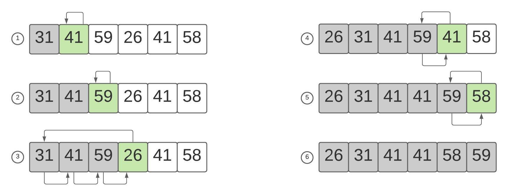

# Сортировка вставками / Insertion sort
## Описание идеи
Сортировка вставками выглядит примерно так, как если бы человек сортировал что-либо. Делим массив на два множества: отсортированных и не отсортированных элементов. Затем мы берем по одному элементу из неотсортированного множества, находим для него позицию в отсортированном множестве и вставляем элемент на данную позицию.

### Конкретный пример

Предположим, что нам нужно отсортировать следующий массив: {31, 41, 59, 26, 41, 58}. Разделим массив на 3 части — уже отсортированную (серая), сортируемый элемент (зеленый), неотсортированную (белая). Сразу же можем положить в отсортированную часть первый элемент массива, поскольку множество из одного элемента является отсортированным.

Начинаем искать позицию для сортируемого элемента в отсортированной части. Поиск происходит справа налево. Ищем позицию, слева от которой элемент будет меньше сортируемого элемента, это будет позицией для нашего элемента. Так как мы ищем место в уже отсортированном массиве, то и все элементы после найденного будут меньше сортируемого, так что нам не нужно их проверять. Сдвигаем все отсортированные элементы, начиная с позиции, куда мы будем вставлять наш элемент, на один шаг вправо. Теперь записываем в найденную позицию сортируемый элемент.

Готово, переходим к следующему элементу.

## Псевдокод
*Индексирование в псевдокоде начинается с 1*
```
// Итерируемся по массиву
for i = 2 to A.len
    // Выбираем сортируемый элемент
    key = A[i]
    
    j = i - 1  // Правая граница отсортированной части
    // Если не вышли за границы массива
    // и если сравниваемый элемент больше чем сортируемый элемент
    // то двигаем сравниваемый элемент вправо
    while j >= 1 and A[j] > key 
        A[j + 1] = A[j]
        j = j - 1
    
    // Записываем сортируемый элемент в подходящее для него место        
    A[j + 1] = key
```
## Реализация на C#
```
 public static class InsertionSort
    {
        public static void Sort(int[] array)
        {
            for (int i = 1; i < array.Length; i++)
            {
                int key = array[i];
                
                int j = i - 1;
                while (j >= 0 && array[j] > key)
                {
                    array[j + 1] = array[j];
                    j--;
                }

                array[j + 1] = key;
            }
        }
    }
```
## Сложность
Сложность сортировки в худшем случае будет N<sup>2</sup>. Но при почти отсортированных массивах сложность алгоритма стремится к N, так как почти не будет обменов элементов.