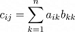

# Умножение матриц
Если **А** - матрица m × n и **B** - матрица n × p, то результатом их перемножения будет матрица **С** размером m × p, где 

### Реализация на C#
```
public static int[,] MultiplicateNaive(int[,] a, int[,] b)
{
    var n = a.GetLength(1);
    if (n != b.GetLength(0))
        throw new ArgumentException("Matrix A must have same number of columns as B matrix rows");

    int[,] c = new int[a.GetLength(0), b.GetLength(1)];
    for (var x = 0; x < c.GetLength(0); x++)
    for (var y = 0; y < c.GetLength(1); y++)
    {
        c[x, y] = 0;
        for (int k = 0; k < n; k++)
            c[x, y] += a[x, k] * b[k, y];
    }

    return c;
}
```
## Алгоритм Штрассена / Strassen's algorithm
Если **A** и **B** - две квадратные матрицы n × n, где n является степенью числа 2, то мы можем ускорить работу обычного алгоритма.
Разделим матрицы **A**, **B** и **C** на равные по размеру блочные матрицы: 


Введем дополнительные матрицы для облегчения подсчета:


Тогда, чтобы посчитать итоговую матрицу **С**:


### Реализация на C#

Сначала реализуем две вспомогательные функции: сложение и вычитание матриц
```
private static int[,] Add(int[,] a, int[,] b)
{
    var n = a.GetLength(0);
    if (n != a.GetLength(1) || n != b.GetLength(0) || n != b.GetLength(1))
        throw new ArgumentException("Matrices a and b should be square and same size");

    var matrixSum = new int[n, n];

    for (int i = 0; i < n; i++)
    {
        for (int j = 0; j < n; j++)
        {
            matrixSum[i, j] = a[i, j] + b[i, j];
        }
    }

    return matrixSum;
}

private static int[,] Subtract(int[,] a, int[,] b)
{
    var n = a.GetLength(0);
    if (n != a.GetLength(1) || n != b.GetLength(0) || n != b.GetLength(1))
        throw new ArgumentException("Matrices a and b should be square and same size");

    var matrixSub = new int[n, n];

    for (int i = 0; i < n; i++)
    {
        for (int j = 0; j < n; j++)
        {
            matrixSub[i, j] = a[i, j] - b[i, j];
        }
    }

    return matrixSub;
}
```
Теперь реализуем непосредственно алгоритм:
```
public static int[,] MultiplicationStrassen(int[,] a, int[,] b)
{
    var n = a.GetLength(0);
    if (n != a.GetLength(1) || n != b.GetLength(0) || n != b.GetLength(1))
        throw new ArgumentException("Matrices a and b should be square and same size");
    if (IsPowerOfTwo(n) == false)
        throw new ArgumentException("Matrices' sizes should be a power of two");

    return MultiplicationStrassenImpl(a, b, n);
}

private static int[,] MultiplicationStrassenImpl(int[,] a, int[,] b, int n)
{
    int[,] c;
    if (n == 1)
    {
        c = new int[1, 1];
        c[0, 0] = a[0, 0] * b[0, 0];
        return c;
    }

    c = new int[n, n];
    var k = n / 2;

    var a11 = new int[k, k];
    var a12 = new int[k, k];
    var a21 = new int[k, k];
    var a22 = new int[k, k];
    var b11 = new int[k, k];
    var b12 = new int[k, k];
    var b21 = new int[k, k];
    var b22 = new int[k, k];

    for (int i = 0; i < k; i++)
    {
        for (int j = 0; j < k; j++)
        {
            a11[i, j] = a[i, j];
            a12[i, j] = a[i, k + j];
            a21[i, j] = a[k + i, j];
            a22[i, j] = a[k + i, k + j];
            b11[i, j] = b[i, j];
            b12[i, j] = b[i, k + j];
            b21[i, j] = b[k + i, j];
            b22[i, j] = b[k + i, k + j];
        }
    }

    var s1 = Subtract(b12, b22);
    var s2 = Add(a11, a12);
    var s3 = Add(a21, a22);
    var s4 = Subtract(b21, b11);
    var s5 = Add(a11, a22);
    var s6 = Add(b11, b22);
    var s7 = Subtract(a12, a22);
    var s8 = Add(b21, b22);
    var s9 = Subtract(a11, a21);
    var s10 = Add(b11, b12);

    var p1 = MultiplicationStrassenImpl(a11, s1, k);
    var p2 = MultiplicationStrassenImpl(s2, b22, k);
    var p3 = MultiplicationStrassenImpl(s3, b11, k);
    var p4 = MultiplicationStrassenImpl(a22, s4, k);
    var p5 = MultiplicationStrassenImpl(s5, s6, k);
    var p6 = MultiplicationStrassenImpl(s7, s8, k);
    var p7 = MultiplicationStrassenImpl(s9, s10, k);

    var c11 = Add(Subtract(Add(p5, p4), p2), p6);
    var c12 = Add(p1, p2);
    var c21 = Add(p3, p4);
    var c22 = Subtract(Subtract(Add(p5, p1), p3), p7);
    
    for (int i = 0; i < k; i++)
    {
        for (int j = 0; j < k; j++)
        {
            c[i, j]         = c11[i, j];
            c[i, j + k]     = c12[i, j];
            c[i + k, j]     = c21[i, j];
            c[i + k, j + k] = c22[i, j];
        }
    }
    
    return c;
}
```


