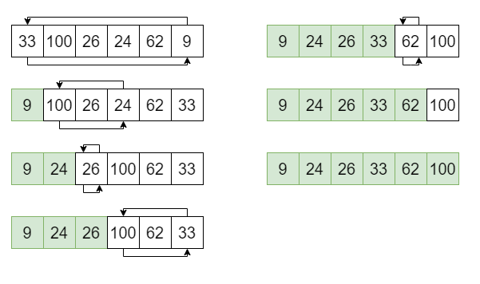

# Сортировка выбором / Selection sort
## Описание идеи
Делим массив на два множества, отсортированное справа и неотсортированное слева. Берем из отсортированной части массива минимальный элемент, меняем его местами с первым элементом в неотсортированной части. Считаем теперь что этот элемент отсортирован. Последний элемент можно не сортировать, он и так является самым большим в массиве
## Конкретный пример


Предположим, что нам нужно отсортировать следующий массив: {33, 100, 26, 24, 62, 9}. Разобьём массив на 2 части — отсортированную (зеленую) и неотсортированную (белую). Отсортированная часть в начале пустая.

Находим минимальный элемент в неотсортированной части: 9 и меняем местами с элементом в 0 позиции: 33. Теперь неотсортированная часть начинается со 100, а в отсортированной части находится 9.

Повторяем для все оставшихся элементов.
## Псевдокод
```
// Итерируемся от по всему массиву, кроме предпоследнего элемента
// Неотсортированная часть массива - A[0:i-1]
// Отсортированная часть массива - A[i:n-1]

for i = 0 to A.len - 2                  
    
    // Начинаем поиск минимального элемента
    minValIndex = A[i]                  
    // Итерируемся до конца неотсортированной части
    for j = i + 1 to A.len - 1              
        if A[minValIndex] > A[j]        
            minValIndex = j             
    // В minValIndex теперь хранится индекс минимального элемента
    // начиная с j'ой позиции
    
    // Меняем элементы в позиции i - начало отсортирвоанной части
    // и minValIndex - индекс минимального элемента в неотсортированной части
    temp = A[j]                         
    A[j] = A[minValIndex]               
    A[minValIndex] = temp;              
```
## Реализация на C#
```
public static class SelectionSort
    {
        public static void Sort(int[] array)
        {
            for (int i = 0; i < array.Length - 1; i++)
            {
                var minValueIndex = i;
                
                for (int j = i + 1; j < array.Length; j++)
                {
                    if (array[minValueIndex] > array[j])
                        minValueIndex = j;
                }

                var temp = array[minValueIndex];
                array[minValueIndex] = array[i];
                array[i] = temp;
            }
        }
    }
```
